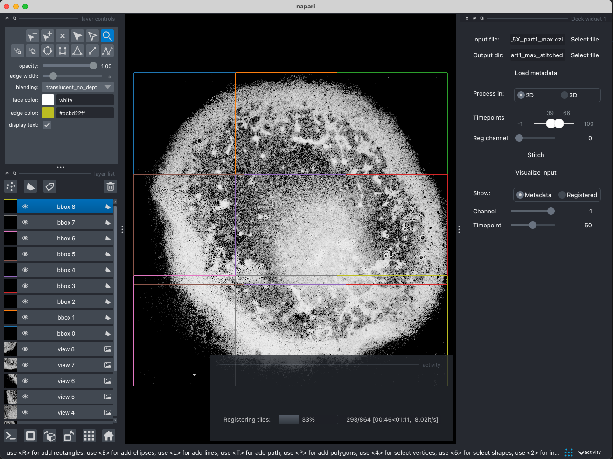

<!--

-->

# napari-stitcher
A napari plugin for stitching 2-3D tiled image datasets using [MVRegFUS](https://github.com/m-albert/MVRegFus).

Work in progress.

----------------------------------

<!--
Don't miss the full getting started guide to set up your new package:
https://github.com/napari/cookiecutter-napari-plugin#getting-started

and review the napari docs for plugin developers:
https://napari.org/stable/plugins/index.html
-->

----------------------------------
## Installation

You can install `napari-stitcher` via [pip]:

- on MacOS: Install PyQT
- install anaconda
- create a new conda environment and install napari

    `conda create -y -n napari-env -c conda-forge python=3.9`

    `conda activate napari-env`

    `conda install -c conda-forge napari`

- currently: download (e.g. clone) napari-stitcher and install using

    `pip install -e napari-stitcher`

This [napari] plugin was generated with [Cookiecutter] using [@napari]'s [cookiecutter-napari-plugin] template.

## Contributing

Contributions are very welcome. Tests can be run with [tox], please ensure
the coverage at least stays the same before you submit a pull request.

## License

Distributed under the terms of the [BSD-3] license,
"napari-stitcher" is free and open source software

## Issues

If you encounter any problems, please [file an issue] along with a detailed description.

[napari]: https://github.com/napari/napari
[Cookiecutter]: https://github.com/audreyr/cookiecutter
[@napari]: https://github.com/napari
[MIT]: http://opensource.org/licenses/MIT
[BSD-3]: http://opensource.org/licenses/BSD-3-Clause
[GNU GPL v3.0]: http://www.gnu.org/licenses/gpl-3.0.txt
[GNU LGPL v3.0]: http://www.gnu.org/licenses/lgpl-3.0.txt
[Apache Software License 2.0]: http://www.apache.org/licenses/LICENSE-2.0
[Mozilla Public License 2.0]: https://www.mozilla.org/media/MPL/2.0/index.txt
[cookiecutter-napari-plugin]: https://github.com/napari/cookiecutter-napari-plugin

[napari]: https://github.com/napari/napari
[tox]: https://tox.readthedocs.io/en/latest/
[pip]: https://pypi.org/project/pip/
[PyPI]: https://pypi.org/

## Ideas / things to check out

- https://github.com/spatial-image
- https://github.com/xarray-contrib/datatree
- https://github.com/carbonplan/ndpyramid
- https://www.napari-hub.org/plugins/affinder

## Notes

- Option to load all layers / selected layers
- Show loaded layers
- keep layers and xims list according to this
- add groupwise optimization
    - e.g. using corners of overlap regions as virtual points. optimize using decomposition parametrizations
    - use the coloring logic to determine / restrict relevant registration pairs
- look at example data on the bioimage archive, e.g. "https://uk1s3.embassy.ebi.ac.uk/idr/zarr/v0.3/9836842.zarr/"