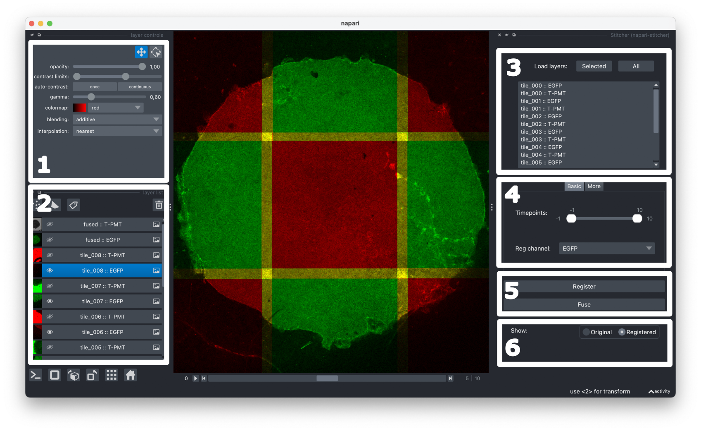

[](https://napari-hub.org/plugins/napari-stitcher)
[](https://github.com/multiview-stitcher/napari-stitcher/raw/main/LICENSE)
[](https://pypi.org/project/napari-stitcher)
[](https://python.org)
[](https://github.com/multiview-stitcher/napari-stitcher/actions)
[](https://codecov.io/gh/multiview-stitcher/napari-stitcher)
[](https://zenodo.org/doi/10.5281/zenodo.13151252)


# napari-stitcher

A napari plugin for stitching large multi-positioning datasets in 2/3D+t using [`multiview-stitcher`](https://github.com/multiview-stitcher/multiview-stitcher).


<small>Image data by Arthur Michaut @ Jérôme Gros Lab @ Institut Pasteur.</small>

#### Quick guide:

1. Directly stitch napari layers: Use napari to load, visualize and [preposition](prearrangement.md) the tiles to be stitched.
2. When working with multi-channel data, stick to the following [naming convention](naming_convention.md): `{tile} :: {channel}`.
3. Load either all or just a subset of the layers into the plugin.
4. Choose registration options: registration channel, binning and more.
5. Stitching = registration (refining the positions, optional) + fusion (joining the tiles into a single image).
6. The registration result is shown in the viewer and the fused channels are added as new layers.

## Demo

https://github.com/user-attachments/assets/8773e49f-af18-4ff3-ab2f-2a5f1b1cadf2

<small>This demo uses the awesome [`napari-threedee`](https://github.com/napari-threedee/napari-threedee) for prepositioning the tiles. Image data: [BigStitcher](https://imagej.net/plugins/bigstitcher/).</small>

## Documentation

Head over to the [user guide](https://multiview-stitcher.github.io/napari-stitcher/main/) for more details.

## Installation

You can install `napari-stitcher` via `pip`:

```bash
pip install napari-stitcher
```

For more installation options, see the [installation docs](https://multiview-stitcher.github.io/napari-stitcher/main/installation/).

## Contributing

Contributions are very welcome. Tests can be run with `tox`.

## License

Distributed under the terms of the [BSD-3] license, "napari-stitcher" is free and open source software

## Issues

If you encounter any problems, please [file an issue](https://github.com/multiview-stitcher/napari-stitcher/issues) along with a detailed description.
